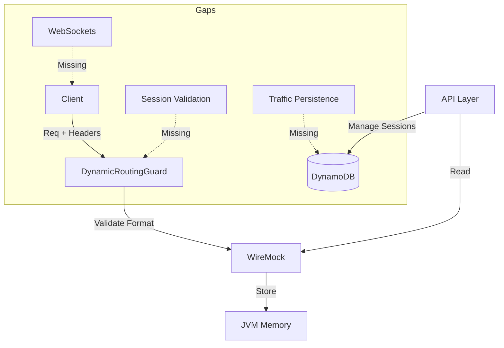

# Current Architecture Snapshot

## Overview
The **WireMock Proxy** is a Kotlin-based backend service designed to proxy HTTP traffic using an embedded **WireMock 3** instance.

## Components & Status

### 1. Proxy Logic
- **Routing**: Handled by `DynamicRoutingGuard`.
- **Validation**:
  - ✅ Checks `X-Mock-Target-Service` exists and is in `SERVICE_MAP`.
  - ✅ Checks `X-Mock-Session-Id` header is present.
  - ❌ **Gap**: Does NOT validate that the session actually exists or is ACTIVE in the database.
- **Service Map**: Loaded from `SERVICE_MAP` env var.

### 2. Traffic Storage
- **Mechanism**: In-Memory (WireMock Journal).
- **Missing**: No persistence. Traffic is lost on restart. Large traffic volume consumes JVM Heap.

### 3. Stub Storage
- **Mechanism**: In-Memory (WireMock internal storage).
- **Missing**: No persistence. Stubs are lost on restart. No "recording" UI/API flow implemented.

### 4. Real-time Updates
- **Mechanism**: None.
- **Missing**: **WebSockets** are completely unimplemented. Frontends act in "pull" mode or have no real-time view.

### 5. Persistence (DynamoDB)
- **Sessions**: `sessions` table exists and is used by `SessionRepository` for CRUD.
- **Traffic/Stubs**: No tables/repositories implemented.

## Architecture Diagram (Current)

