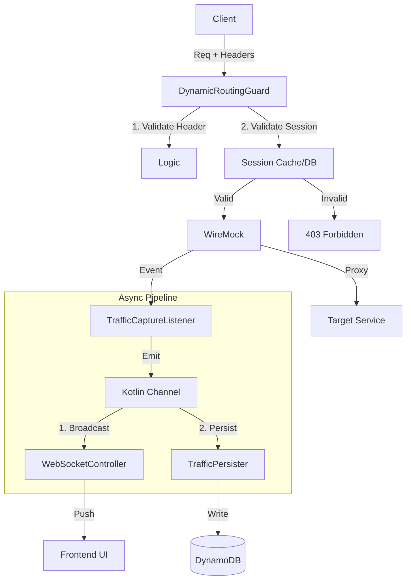

# Target Architecture (v2)

## Goals
- **Persistence**: Sessions, Traffic, and Stubs survive restarts.
- **Real-Time Visibility**: Frontend receives traffic updates instantly via WebSockets.
- **Robustness**: Proxy logic strictly validates active sessions.
- **Efficiency**: Large traffic bodies are truncated; async writes prevent latency.

## Architecture Guidelines

### 1. Data Flow & Components



### 2. Component Details

#### A. WebSocket Support (New)
- **Role**: Push real-time traffic to connected clients.
- **Implementation**: Ktor WebSockets (`io.ktor:ktor-server-websockets`).
- **Topic**: `session-{id}-traffic`.
- **Flow**: `TrafficCaptureListener` emits to a `SharedFlow`/`BroadcastChannel`. The `WebSocketController` subscribes and pushes frames to active connections.

#### B. Persistence (DynamoDB)
- **Traffic**:
  - **Table**: `proxy-traffic` (PK: `sessionId`, SK: `timestamp`).
  - **Handling**: Bodies > 350KB truncated to avoid DDB Item Limit errors.
  - **Journal**: WireMock Journal DISABLED to save memory.
- **Stubs**:
  - **Table**: `stubs` (PK: `sessionId`, SK: `stubId`).
  - **Sync**: `StubService` guarantees DDB and WireMock are in sync.
  - **Recording**: "Create Stub from Request" API saves to DB, then loads into WireMock.

#### C. Proxy Logic Hardening
- **DynamicRoutingGuard**:
  - **Add**: Lookup `sessionId` in `SessionRepository` (or a short-lived memory cache) to ensure it is `ACTIVE` and exists.
  - **Reject**: 403/404 if session is closed/expired.

#### D. Service Map
- **Validation**: Current logic (checking `SERVICE_MAP` env) is correct and will be preserved.

## Data Models

### Traffic Item (DynamoDB)
```json
{
  "sessionId": "abc-123",
  "timestamp": 1234567890,
  "method": "POST",
  "path": "/api/v1/pay",
  "requestBody": "{...}", // Truncated if >350KB
  "responseBody": "{...}", // Truncated if >350KB
  "stubbed": false,
  "duration": 45
}
```

### Stub Item (DynamoDB)
```json
{
  "sessionId": "abc-123",
  "stubId": "uuid",
  "priority": 10,
  "pattern": { "method": "GET", "url": "/foo" },
  "response": { "status": 200, "body": "..." },
  "expiresAt": 123456
}
```
